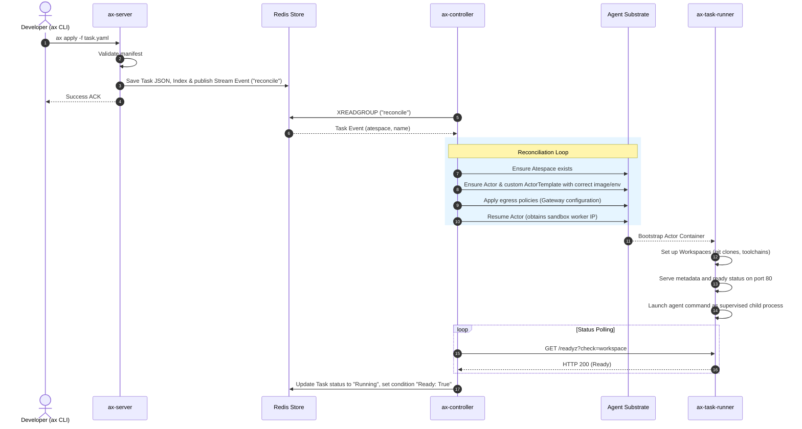

# AX Architecture

AX is designed around a fast Redis store and stream queue that separates the API ingestion plane from the sandboxed agent reconciliation loop, ensuring high scalability and isolation.

---

## Key Abstractions

- **Atespace:** A logical tenant namespace on Agent Substrate used to group related Tasks, Workspaces, and Gateways.
- **Task:** The core workload specification. It describes a container image, an executable command, environment variables, resource requirements, bound workspaces, gateway targets, and state tracking (e.g. `Pending`, `Running`, `Suspended`, `Failed`, `Terminating`).
- **Workspace:** A persistent or ephemeral working environment configured with git repositories to clone, Model Context Protocol (MCP) servers, and skill registries.
- **Gateway:** A security and routing configuration defining listeners and egress port/host allowlists applied to the agent sandbox.
- **Model:** Centralized LLM configuration mapping API endpoints, credentials (via secrets), parameter settings, and providers.

---

## Core Components

```
                   [ax CLI] (developer workstation)
                      │
            gRPC over port-forward tunnel
                      │
                      ▼
               [ax-server] (gRPC API, port 8080)
                      │
         persists JSON & publishes events
                      │
                      ▼
            [Redis Hash + Stream Queue]
                      │
               XREADGROUP subscription
                      │
                      ▼
             [ax-controller] (scaled worker replicas)
                      │
       gRPC (ateapipb.ControlClient)
                      │
                      ▼
             [Agent Substrate] (sandbox controller)
               └─► [Actor Sandbox (Atespace)]
                     └─► [ax-task-runner] (supervisor)
                           ├─► [Command Process]
                           └─► [Metadata Server]
```

### 1. `ax` (Developer CLI)
Allows developers to interact with the control plane: apply/get/describe manifests, watch status, suspend/resume tasks, or tunnel (`ax ssh`) to active sandboxes.

### 2. `ax-server`
Stateless gRPC API server serving port 8080. Validates incoming resource definitions, persists them as protobuf-JSON strings inside Redis keys, and publishes event payloads onto the Redis Stream work queue.

### 3. `ax-controller`
Horizontally scaled task reconcilers consuming the Redis Stream via a shared consumer group (`ax-controllers`). Each worker processes events by driving sandboxes on Agent Substrate toward their desired state.

### 4. `ax-task-runner`
The entrypoint inside every Actor sandbox. It starts first, configures bound workspaces (clones git repos, sets up skills, runs `antigravity_bootstrap.py` for goals), spins up metadata/guest servers, and supervises the user command process.

---

## Core Data & Control Flows

### Task Submission and Reconciliation Sequence


