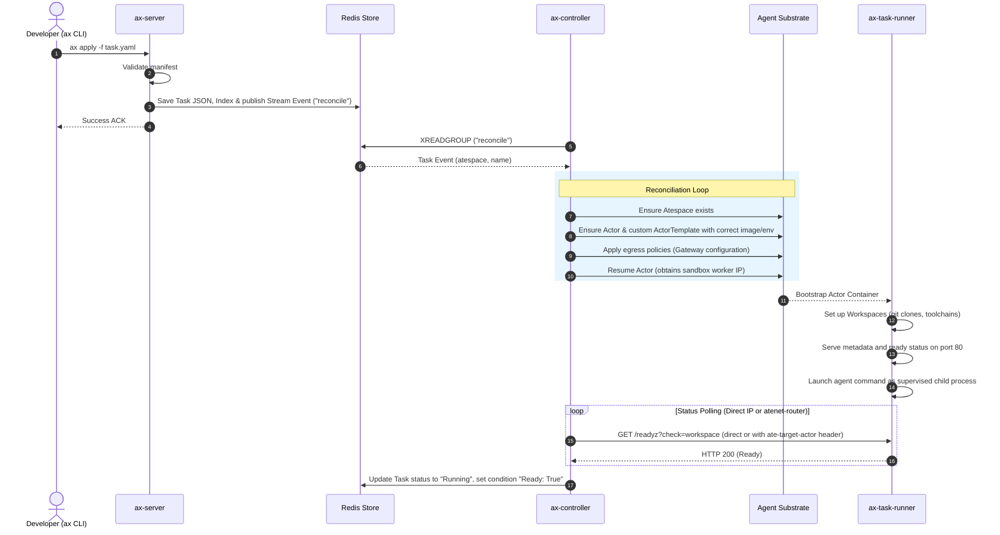

# AX Architecture

AX is designed around a fast Redis store and stream queue that separates the API ingestion plane from the sandboxed agent reconciliation loop, ensuring high scalability and isolation.

---

## Key Abstractions

- **Atespace:** A logical tenant namespace on Agent Substrate used to group related Tasks, Workspaces, and Gateways.
- **Task:** The core workload specification. It describes a container image, an executable command, environment variables, resource requirements, bound workspaces, gateway targets, and state tracking (e.g. `Pending`, `Running`, `Suspended`, `Failed`, `Terminating`).
- **Workspace:** A persistent or ephemeral working environment configured with git repositories to clone, Model Context Protocol (MCP) servers, and skill registries.
- **Gateway:** A security and routing configuration defining listeners and egress port/host allowlists applied to the agent sandbox.
- **Model:** Centralized LLM configuration mapping API endpoints, credentials (via secrets), parameter settings, and providers.

---

## Core Components

```
                   [ax CLI] (developer workstation)
                      │
            gRPC over port-forward tunnel
                      │
                      ▼
               [ax-server] (gRPC API, port 8080)
                      │
         persists JSON & publishes events
                      │
                      ▼
            [Redis Hash + Stream Queue]
                      │
               XREADGROUP subscription
                      │
                      ▼
             [ax-controller] (scaled worker replicas)
                      │
       gRPC (ateapipb.ControlClient)
                      │
                      ▼
             [Agent Substrate] (sandbox controller)
               └─► [Actor Sandbox (Atespace)]
                     └─► [ax-task-runner] (supervisor)
                           ├─► [Command Process]
                           └─► [Metadata Server]
```

### 1. `ax` (Developer CLI)
Allows developers to interact with the control plane: apply/get/describe manifests, watch status, suspend/resume tasks, or tunnel (`ax ssh`) to active sandboxes.

### 2. `ax-server`
Stateless gRPC API server multiplexing HTTP/1.1, unencrypted HTTP/2, and gRPC on port 8080 (configurable via `-addr` or `ADDR`). It validates incoming resource definitions (normalizing legacy schemas in `pkg/apis/v1alpha1/types.go`), persists them as protobuf-JSON strings inside Redis keys using transactional pipelines (`TxPipeline`), and publishes event payloads onto the Redis Stream work queue.

### 3. `ax-controller`
Horizontally scaled task reconcilers subscribing to the Redis Stream via a shared consumer group (`ax-controllers`). Each worker processes events by communicating with the Agent Substrate Control API (gRPC `ateapipb.ControlClient` at `api.ate-system.svc.cluster.local:443`) to manage logical Atespaces, sandbox Actors, custom templates, and security network policies (Gateways).

### 4. `ax-task-runner`
The container entrypoint binary (Go supervisor wrapping the `runner` package) executing inside every Actor sandbox on port 80 (configurable). It starts first, multiplexes cloud-style metadata endpoints (`/metadata/...`) and guest gRPC daemon services on a single port, prepares the bound workspaces (clones git repos via idempotent fetch with retry, runs `antigravity_bootstrap.py` for goal synthesis), reports readiness via `/readyz?check=workspace`, and supervises the user command process inside its own process group.

---

## Core Data & Control Flows

### Task Submission and Reconciliation Sequence



---

## Known Status & Lifecycle Limitations

As of the **v0.3.0** release, there is a known limitation in how AX tracks task lifecycles (see **Issue #346**):
- **Command Termination:** Once a Task reaches the `Running` phase and `Ready: True` is set, the controller does not continuously monitor if the user command has exited or if the underlying container process group has terminated.
- **Indefinite Running Status:** A task will continue to report `Running` and `Ready: True` even after the user command exits (either successfully or with a non-zero exit code), or if the Substrate actor transitions to `ACTOR_STATE_CRASHED`.
- **Planned Work:** Enhancing the reconciliation loop or metadata service to report process health status and capture exit codes to transition tasks into terminal phases (`Succeeded`/`Failed`).
